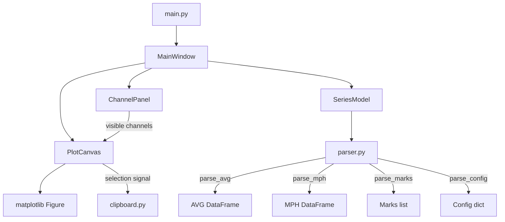
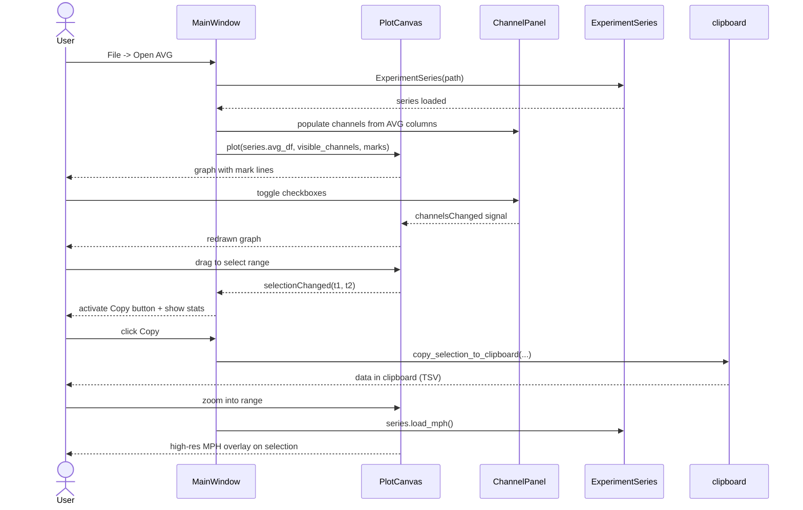

# План разработки: AVG Viewer

## Форматы файлов серии

Каждая серия — набор файлов с общим префиксом `{N}_{год}_{название}`:

### Текстовые файлы

| Файл | Описание | Строк | Разделитель |
|------|----------|-------|-------------|
| `_001.AVG` | Усреднение по 2 сек | ~3400 | Tab, запятая |
| `_001.MPH` | Поударные данные | ~47000 | Tab, запятая |
| `.MIN` | Усреднение по 1 мин | ~130 | Tab, запятая |
| `_Marks.txt` | Метки событий | ~10-20 | Tab |
| `_Config_Info.txt` | Конфигурация | ~28 | Текст |

### Структура `_001.AVG` и `_001.MPH`

```
Строка 1: 20251120_time_11:39:16       <- дата/время создания файла
Строка 2: 20251120_11,6545833          <- дата_часы.доля
Строка 3: Exp Name: клонидин мкт
Строка 4: Start Time: 2025-11-20 - 11:22:09
Строка 5: First Name: 21
Строка 6: Project: 2025
Строка 7: (описание Respiration Rate)
Строка 8: Заголовки столбцов (Tab)
Строки 9+: данные (Tab, десятичная ЗАПЯТАЯ)
```

**Столбцы AVG:** `Counts | RunTime_s | RunTime_dh | HR bpm | Mean BP | Syst BP | Diast BP | Max_dBP/dT | Syst LVP | Diast LVP | EDP | Max_dLVP | Min_dLVP | Max_dLVP/P | Min_dLVP/P | DvP | ICF | BIN Offset`

**Столбцы MPH:** `Syst time ms | RunTime_dh | Syst BP | Diast BP | Mean BP | PI ms | Max_dBP/dT | Syst LVP | Diast LVP | EDP | Max_dLVP | Min_dLVP | Max_dLVP/P | Min_dLVP/P | DvP | ICF | BIN Offset`

**Ключевые поля:**
- `RunTime_dh` — часы суток с дробной частью (11,654583 = 11:39:16)
- `BIN Offset` — смещение в байтах в бинарном файле `_AVG-LV_NNN` (сырые данные АЦП)
- `NaN` — отсутствующие значения (нужна обработка)

### Структура `_Marks.txt`
```
{N}   - {HH:MM:SS} - Day {D} - {YYYY-MM-DD} -  {текст}   {мин_от_старта}   {RunTime_dh}   {доля/24}
```
Пример: `1  - 11:50:01 - Day 1 - 2025-11-20 -  np 4,5 mkg   27,88   11,834027778   0,493084491`

### Структура `.MIN`
Без заголовка, сразу данные. Столбцы аналогичны AVG (без `Counts` и `RunTime_s` — вместо них `индекс` и `RunTime_dh`).
Последний столбец — BIN Offset (-1.00 = данных нет).

### Бинарные файлы (LabVIEW native format)
- `_AVG-LV_NNN` — сырые данные АЦП, блоки по 2 сек; адресуются через BIN Offset
- `_St-Time_LV` — timestamp начала записи
- `_Config_LV` — конфигурация LabVIEW
- `_001.BPK` — предположительно backup пульсовых пиков

---

## Архитектура приложения

### Стек
- **Python 3.10+**
- **PyQt6** — GUI-фреймворк
- **matplotlib** — графики (встроен в PyQt6 через `FigureCanvasQTAgg`)
- **pandas** — парсинг и обработка табличных данных
- **numpy** — вычисления

### Структура проекта

```
avg-viewer/
├── main.py                    # Точка входа
├── requirements.txt
├── data/
│   ├── __init__.py
│   ├── parser.py              # Парсеры всех форматов
│   └── series.py              # Модель одной серии (набора файлов)
├── ui/
│   ├── __init__.py
│   ├── main_window.py         # Главное окно
│   ├── plot_canvas.py         # Matplotlib canvas + взаимодействие
│   └── channel_panel.py       # Панель чекбоксов каналов
└── utils/
    ├── __init__.py
    └── clipboard.py           # Форматирование и копирование в буфер
```

### Диаграмма компонентов



---

## Модули и их ответственность

### `data/parser.py`

```python
def parse_avg(filepath: Path) -> pd.DataFrame
def parse_mph(filepath: Path) -> pd.DataFrame
def parse_min(filepath: Path) -> pd.DataFrame
def parse_marks(filepath: Path) -> list[dict]
def parse_config(filepath: Path) -> dict
```

- Обрабатывает десятичную запятую (locale-aware)
- Заменяет `NaN`-строки на `float('nan')`
- `parse_marks` возвращает список `{index, time_str, day, date, text, minutes, runtime_dh}`

### `data/series.py` — класс `ExperimentSeries`

```python
class ExperimentSeries:
    def __init__(self, avg_path: Path)
    def load_avg(self) -> pd.DataFrame
    def load_mph(self) -> pd.DataFrame   # lazy load
    def load_min(self) -> pd.DataFrame
    def load_marks(self) -> list[dict]
    def load_config(self) -> dict
    @property
    def name(self) -> str
    @property
    def available_files(self) -> dict[str, Path]
```

Автоматически находит все связанные файлы по префиксу AVG-файла.

### `ui/main_window.py` — класс `MainWindow(QMainWindow)`

- Меню **File → Open AVG...** → открывает `QFileDialog`
- Слева: `ChannelPanel` — чекбоксы серий (столбцов)
- Центр: `PlotCanvas`
- Снизу: `QStatusBar` — показывает координаты курсора при наведении
- Кнопка **Copy Selection** → активна при наличии выделения

### `ui/plot_canvas.py` — класс `PlotCanvas(FigureCanvasQTAgg)`

**Функциональность:**
- Отображает выбранные серии из AVG (ось X = `RunTime_dh` или время в мин от старта)
- Отрисовывает вертикальные линии для каждой метки из Marks с подписью текста
- Зум: колесо мыши / Zoom-кнопка matplotlib toolbar
- Пан: средняя кнопка или toolbar
- **Выделение диапазона**: зажать левую кнопку → зелёный прямоугольник → отпустить → испускает сигнал `selectionChanged(start_dh, end_dh)`
- При выделении внизу появляется информация о среднем по каждой видимой серии

### `ui/channel_panel.py` — класс `ChannelPanel(QWidget)`

- Чекбокс для каждого столбца из AVG (кроме служебных: Counts, RunTime_s, RunTime_dh, BIN Offset)
- Кнопки **Все / Снять**
- При изменении состояния чекбоксов испускает сигнал `channelsChanged(list[str])`

### `utils/clipboard.py`

```python
def copy_selection_to_clipboard(
    df: pd.DataFrame,
    visible_columns: list[str],
    start_dh: float,
    end_dh: float
) -> None
```

- Фильтрует строки по диапазону `RunTime_dh`
- Выбирает только видимые колонки
- Форматирует как TSV (Tab, десятичная точка для Excel)
- Помещает в `QApplication.clipboard()`

---

## Пользовательский сценарий (workflow)



---

## План реализации (по шагам)

### Шаг 1: Парсеры данных (`data/parser.py`)
- `parse_avg` — чтение TSV с заголовком из 7 строк, запятая как десятичный разделитель
- `parse_marks` — парсинг строк Marks с регекспом
- `parse_config` — извлечение конфигурации
- `parse_mph` — аналог parse_avg с другой колонкой времени
- `parse_min` — без метаданных

### Шаг 2: Модель серии (`data/series.py`)
- Поиск файлов по паттерну от AVG
- Lazy-загрузка MPH (большой файл)

### Шаг 3: Базовое окно (`ui/main_window.py`, `ui/channel_panel.py`)
- Скелет MainWindow с меню
- ChannelPanel с чекбоксами

### Шаг 4: График (`ui/plot_canvas.py`)
- Встраивание matplotlib в PyQt6
- Отрисовка AVG-серий
- Отображение меток как вертикальных линий с аннотациями
- Навигация (zoom/pan через стандартный toolbar)

### Шаг 5: Выделение диапазона
- RubberBand-выделение мышью на canvas
- Подсветка выбранного диапазона (серый прямоугольник)
- Сигнал с границами выделения

### Шаг 6: Копирование в буфер (`utils/clipboard.py`)
- Форматирование выбранных данных как TSV
- Первая строка — заголовки, далее данные
- Десятичный разделитель — точка (для Excel)

### Шаг 7: MPH-детализация
- При наличии выделения — кнопка "Показать MPH"
- Загрузка MPH, фильтрация по диапазону, наложение на график

### Шаг 8: Полировка UX
- Статус-бар с координатами курсора
- Сохранение последней открытой директории
- Обработка ошибок (файл не найден, повреждён)

---

## `requirements.txt`

```
PyQt6>=6.5
matplotlib>=3.7
pandas>=2.0
numpy>=1.24
```
